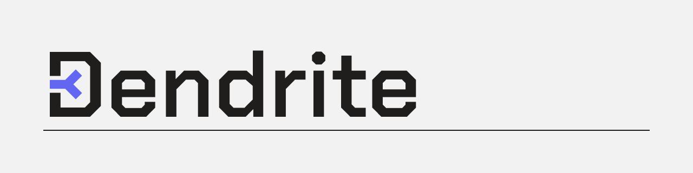

<!-- Dendrite README header. Drop the exported banner into docs/ or .github/ -->

  

  
  
  
  
  

> A declarative dataflow language with incremental reactive evaluation, embeddable in TypeScript.
